# Домашнее задание к занятию "`Репликация и масштабирование. Часть 1`" - `Котуков Евгений`

---

### Задание 1

На лекции рассматривались режимы репликации master-slave, master-master, опишите их различия.

*Ответить в свободной форме.*

### Решение:

В репликации master-slave один главный сервер и один/несколько подчиненных, на мастере все операции записи, слейвы обрабатывают операции чтения \
Эффективно для систем, где количество операций чтения превышает количество операций записи \
Если мастер упал, запись останавливается, пока не выполнить переключение роли

В репликации master-master все серверы равноправны, одновременно и мастеры и слейвы друг для друга, все типы операций обрабатывает любая реплика \
Повышает отказоустойчивость \
Повышает риск конфликтов данных

---

### Задание 2

Выполните конфигурацию master-slave репликации, примером можно пользоваться из лекции.

*Приложите скриншоты конфигурации, выполнения работы: состояния и режимы работы серверов.*


### Решение:

#### Настройка конфига на мастере:

Поднял на второй ВМ еще один инстанс MySQL, далее настроил конфиг на мастере (ВМ с IP 192.168.56.13 в интернал сети) \
в файле /etc/mysql/mysql.conf.d/mysqld.cnf раскомментировал:
```
server-id		= 1
log_bin			= /var/log/mysql/mysql-bin.log
```

А также добавил в конце файла строку:
```
binlog_format = ROW
```

Параметр bind-address		= 0.0.0.0 был выставлен еще в прошлых заданиях для корректного подключения с админской ВМ через dbeaver

Далее перезапустил mysql

Затем создал пользователя для репликации на мастере командами (здесь IP от ВМ с будущей репликой):
```
create user 'repl'@'192.168.56.14' identified with mysql_native_password by 'repl_password';

grant replication slave on *.* to 'repl'@'192.168.56.14';

flush privileges;
```

Далее смотрим права:
```
show grants for 'repl'@'192.168.56.14';
```

И получаем следующий результат:

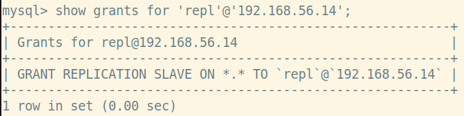

#### Далее настраиваем Slave:

В конфиге изменяю bind_address на аналогичный 0.0.0.0, а также меняю server-id и добавляю следующие значения:
```
server-id               = 2
relay_log = /var/log/mysql/mysql-relay-bin.log
read_only = 1
```

Затем делаю рестарт mysql

После чего проверяю, что переменные применились:

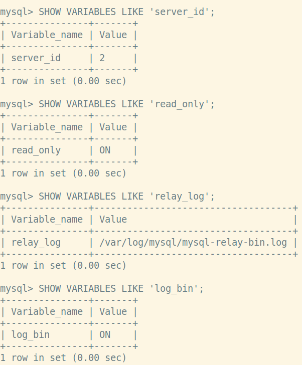

И проверяю доступ slave к master:

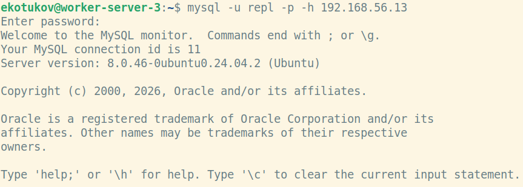

#### Поднимаем на реплике дамп Sakila

Репликация в MySQL не копирует состояние базы, а воспроизводит только новые изменения, \
поэтому нужно восстановить на реплике базу из дампа (предварительно его создав)

Создаю дамп на мастере командой:
```
sudo mysqldump --databases sakila \
  --single-transaction \
  --source-data=2 \
  --triggers \
  --routines \
  --events \
  > /tmp/sakila_repl.sql
```

Проверяю MASTER_LOG_POS:
```
ekotukov@worker-server-2:~$ grep "CHANGE" /tmp/sakila_repl.sql
-- CHANGE MASTER TO MASTER_LOG_FILE='mysql-bin.000001', MASTER_LOG_POS=851;
```

Затем scp-шу его на ноду реплику и восстанавливаю на ней командой:
```
sudo mysql < /tmp/sakila_repl.sql
```

После этого захожу в mysql shell на реплике и выполняю следующие команды:
```
mysql> stop replica;
Query OK, 0 rows affected, 1 warning (0.00 sec)

mysql> change replication source to
    -> SOURCE_HOST='192.168.56.13',
    -> SOURCE_USER='repl',
    -> SOURCE_PASSWORD='repl_password',
    -> SOURCE_LOG_FILE='mysql-bin.000001',
    -> SOURCE_LOG_POS=851;
Query OK, 0 rows affected, 2 warnings (0.02 sec)

mysql> start replica;
Query OK, 0 rows affected (0.03 sec)
```

Далее проверяю состояние репликации:
```
mysql> SHOW REPLICA STATUS\G
*************************** 1. row ***************************
             Replica_IO_State: Waiting for source to send event
                  Source_Host: 192.168.56.13
                  Source_User: repl
                  Source_Port: 3306
                Connect_Retry: 60
              Source_Log_File: mysql-bin.000001
          Read_Source_Log_Pos: 851
               Relay_Log_File: mysql-relay-bin.000002
                Relay_Log_Pos: 326
        Relay_Source_Log_File: mysql-bin.000001
           Replica_IO_Running: Yes
          Replica_SQL_Running: Yes
              Replicate_Do_DB:
          Replicate_Ignore_DB:
           Replicate_Do_Table:
       Replicate_Ignore_Table:
      Replicate_Wild_Do_Table:
  Replicate_Wild_Ignore_Table:
                   Last_Errno: 0
                   Last_Error:
                 Skip_Counter: 0
          Exec_Source_Log_Pos: 851
              Relay_Log_Space: 536
              Until_Condition: None
               Until_Log_File:
                Until_Log_Pos: 0
           Source_SSL_Allowed: No
           Source_SSL_CA_File:
           Source_SSL_CA_Path:
              Source_SSL_Cert:
            Source_SSL_Cipher:
               Source_SSL_Key:
        Seconds_Behind_Source: 0
Source_SSL_Verify_Server_Cert: No
                Last_IO_Errno: 0
                Last_IO_Error:
               Last_SQL_Errno: 0
               Last_SQL_Error:
  Replicate_Ignore_Server_Ids:
             Source_Server_Id: 1
                  Source_UUID: 0212348f-6d45-11f1-9c2e-080027e2ac2b
             Source_Info_File: mysql.slave_master_info
                    SQL_Delay: 0
          SQL_Remaining_Delay: NULL
    Replica_SQL_Running_State: Replica has read all relay log; waiting for more updates
           Source_Retry_Count: 86400
                  Source_Bind:
      Last_IO_Error_Timestamp:
     Last_SQL_Error_Timestamp:
               Source_SSL_Crl:
           Source_SSL_Crlpath:
           Retrieved_Gtid_Set:
            Executed_Gtid_Set:
                Auto_Position: 0
         Replicate_Rewrite_DB:
                 Channel_Name:
           Source_TLS_Version:
       Source_public_key_path:
        Get_Source_public_key: 0
            Network_Namespace:
1 row in set (0.00 sec)
```

#### Проверка:

На мастере выполняю следующие команды:
```
mysql> CREATE DATABASE repl_test;
Query OK, 1 row affected (0.00 sec)

mysql> create table test_table (
    -> id int primary key,
    -> name varchar(100)
    -> );
Query OK, 0 rows affected (0.02 sec)

mysql> insert into test_table values (1, 'Hello from master');
Query OK, 1 row affected (0.00 sec)
```

И теперь проверяем на реплике:

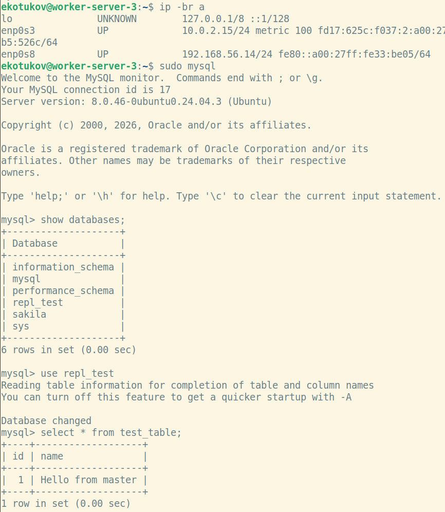

---

## Дополнительные задания (со звёздочкой*)
Эти задания дополнительные, то есть не обязательные к выполнению, и никак не повлияют на получение вами зачёта по этому домашнему заданию. Вы можете их выполнить, если хотите глубже шире разобраться в материале.

---

### Задание 3*

Выполните конфигурацию master-master репликации. Произведите проверку.

*Приложите скриншоты конфигурации, выполнения работы: состояния и режимы работы серверов.*

### Решение:

#### Редактируем конфиг текущего слейва:

Для начала закомментировал строку read_only = 1

Затем выполнил restart mysql.service и проверяю значения нужных переменных:

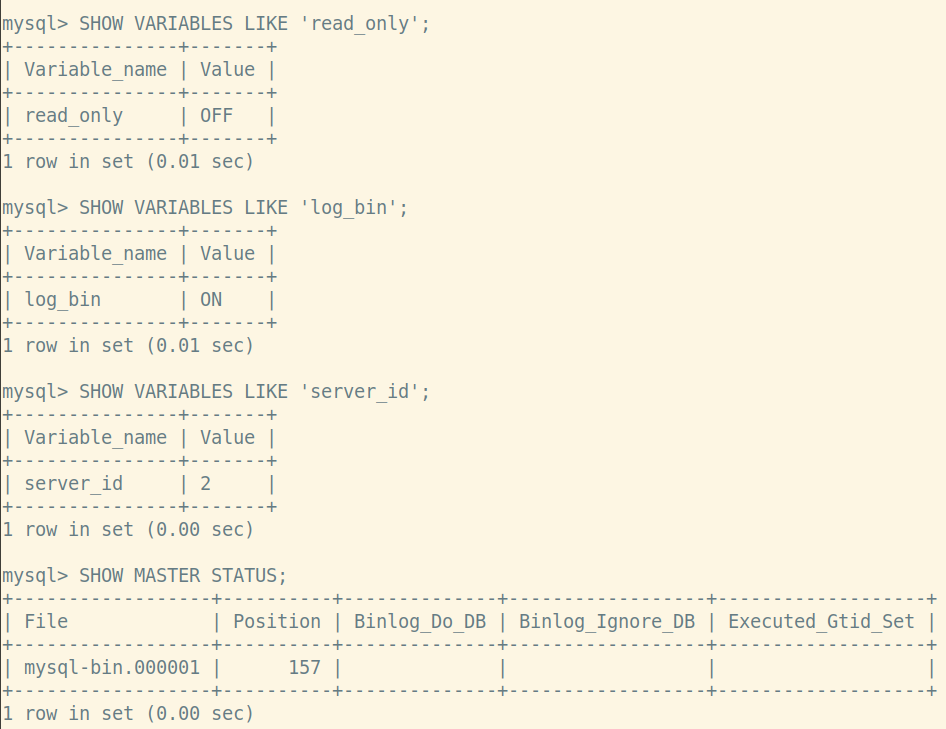

Затем создал аналогичного repl пользователя для ВМ 192.168.56.14:

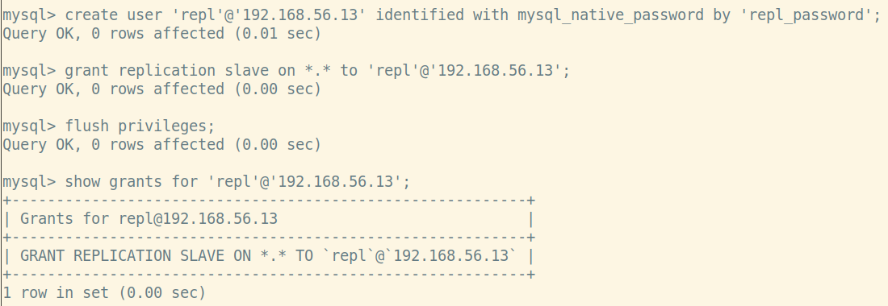

Далее командой show master status; посмотрел File и Position для дальнейшей настойки репликации:

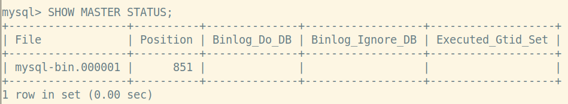

#### Настраиваем текущий мастер быть еще и репликой:

После этого уже на хосте 192.168.56.13, который изначально был мастером, захожу в mysql shell и выполняю след. команды:
```
mysql> stop replica;
Query OK, 0 rows affected, 1 warning (0.00 sec)

mysql> change replication source to
    -> SOURCE_HOST='192.168.56.14',
    -> SOURCE_USER='repl',
    -> SOURCE_PASSWORD='repl_password',
    -> SOURCE_LOG_FILE='mysql-bin.000001',
    -> SOURCE_LOG_POS=851;
Query OK, 0 rows affected, 2 warnings (0.01 sec)

mysql> start replica;
Query OK, 0 rows affected (0.03 sec)
```
Проверяю статус на 192.168.56.13 командой SHOW REPLICA STATUS\G

И в первый раз почему-то на хосте 192.168.56.13 возникала ошибка:
```
mysql> SHOW REPLICA STATUS\G
*************************** 1. row ***************************
             Replica_IO_State:
                  Source_Host: 192.168.56.14
                  Source_User: repl
                  Source_Port: 3306
                Connect_Retry: 60
              Source_Log_File: mysql-bin.000001
          Read_Source_Log_Pos: 851
               Relay_Log_File: worker-server-2-relay-bin.000002
                Relay_Log_Pos: 326
        Relay_Source_Log_File: mysql-bin.000001
           Replica_IO_Running: No
          Replica_SQL_Running: No
```

Повторная попытка старта реплики приводила к ошибке:
```
mysql> start replica;
ERROR 1872 (HY000): Replica failed to initialize applier metadata structure from the repository
```

Пришлось выполнить stop replica, затем reset replica all и повторить предыдущие команды

Заодно после сброса задал в конфиге явно relay_log = /var/log/mysql/mysql-relay-bin.log;

Далее снимаю статус реплик с обоих инстансов и проверяю на отсутствие ошибок:

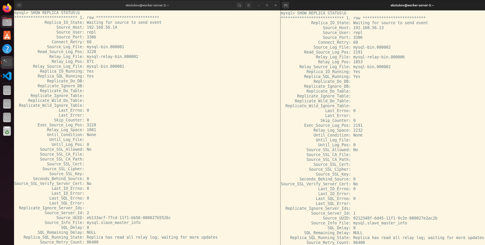

#### Проверка master-master:

Сначала на 192.168.56.13 выполняю:

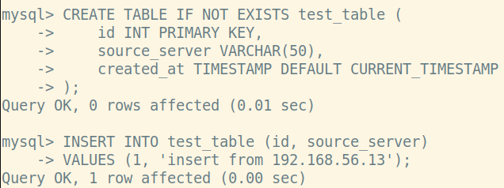

Проверяем на 192.168.56.14:

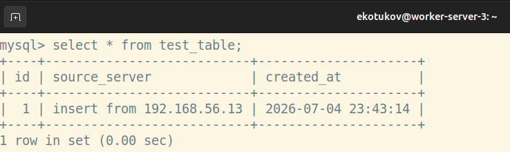

Далее на 192.168.56.14 выполняю:
```
mysql> insert into test_table (id, source_server) values (2, 'insert from 192.168.56.14');
Query OK, 1 row affected (0.01 sec)
```

И проверяю на 192.168.56.13:

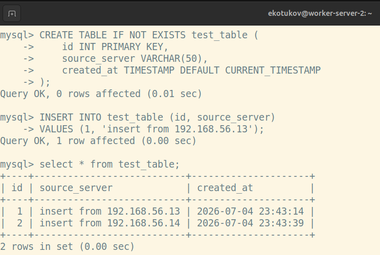